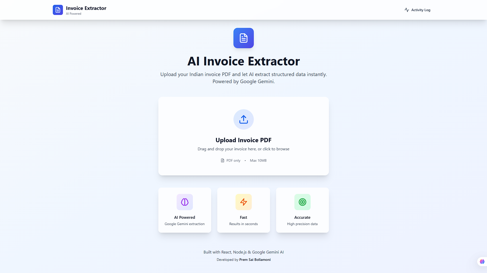
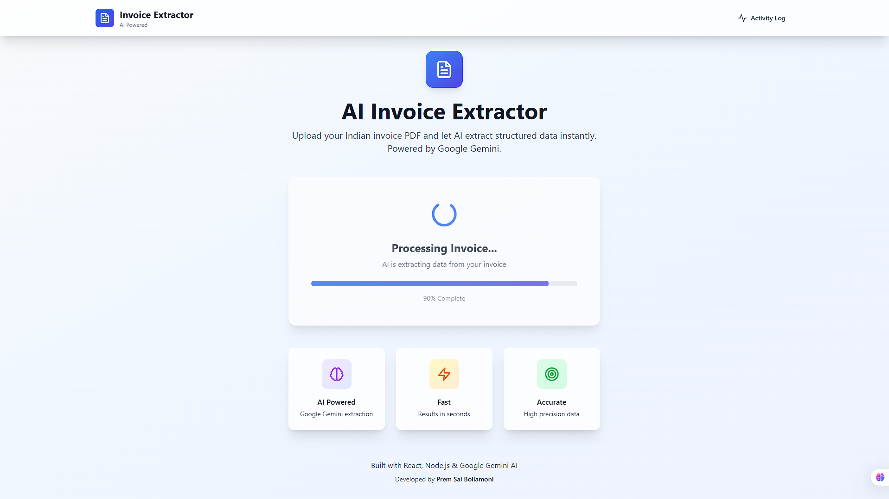
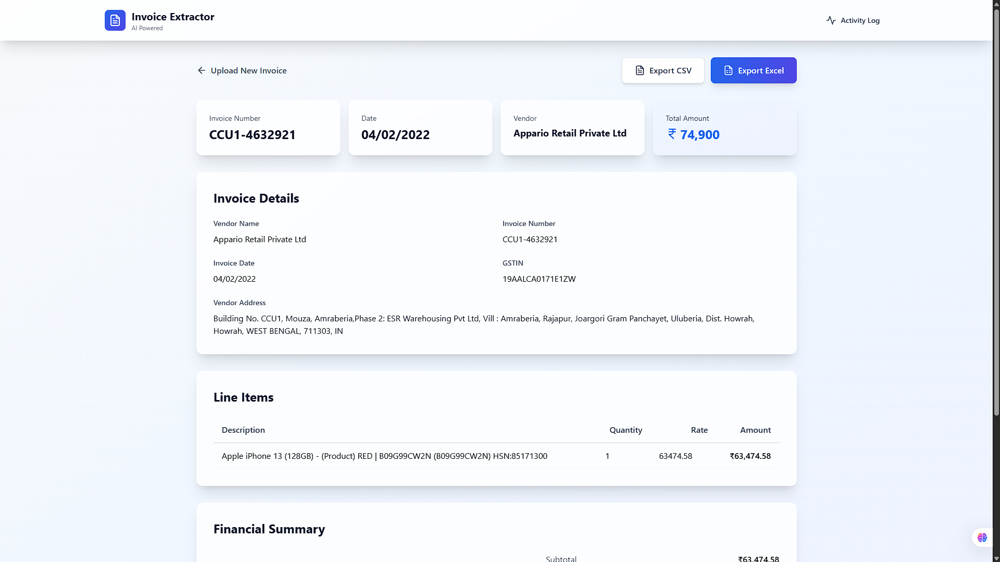
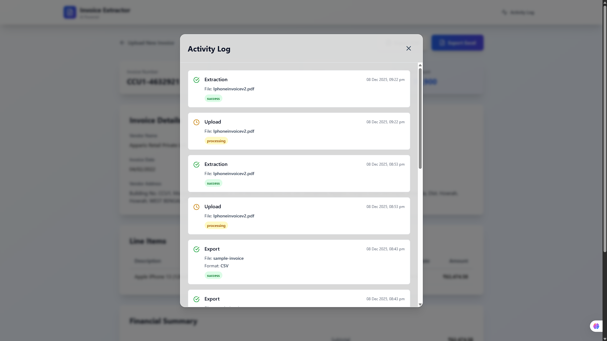
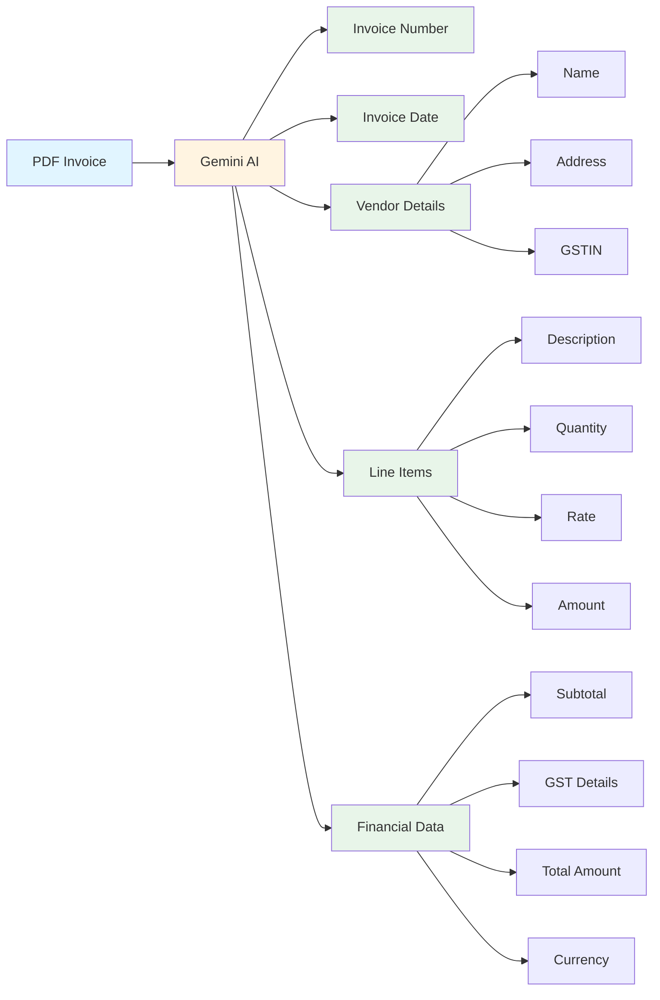
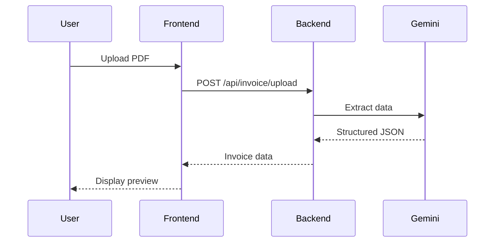

<div align="center">

# 🚀 AI Invoice Extractor

### Intelligent PDF Invoice Data Extraction with Google Gemini AI

[](https://reactjs.org/)
[](https://nodejs.org/)
[](https://ai.google.dev/)
[](https://opensource.org/licenses/MIT)

**[Features](#-features) • [Demo](#-demo) • [Installation](#-installation) • [Usage](#-usage) • [Tech Stack](#-tech-stack) • [API](#-api-documentation)**

---


*Transform PDF invoices into structured data in seconds*

</div>

---

## 📋 Table of Contents

- [Overview](#-overview)
- [Screenshots](#-screenshots)
- [Features](#-features)
- [Demo](#-demo)
- [Tech Stack](#-tech-stack)
- [Installation](#-installation)
- [Usage](#-usage)
- [Project Structure](#-project-structure)
- [API Documentation](#-api-documentation)
- [Configuration](#-configuration)
- [Troubleshooting](#-troubleshooting)
- [Author](#-author)

---

## 🎯 Overview

**AI Invoice Extractor** is a modern web application that leverages Google's Gemini AI to automatically extract structured data from PDF invoices. Built with React and Node.js, it provides a seamless experience for uploading invoices, viewing extracted data, editing fields, and exporting to Excel or CSV formats.

### 🎪 Key Highlights

<table>
<tr>
<td width="50%">

#### 🤖 AI-Powered Extraction
Uses Google Gemini 1.5 Flash for accurate invoice data extraction with support for multiple currencies and Indian GST invoices.

</td>
<td width="50%">

#### ✏️ Editable Preview
Review and edit any extracted field before exporting. Inline editing with save/cancel functionality.

</td>
</tr>
<tr>
<td width="50%">

#### 📊 Multiple Export Formats
Download extracted data as Excel (.xlsx) with multiple sheets or CSV format with proper headers.

</td>
<td width="50%">

#### 📝 Activity Logging
Track all operations with timestamps, success/failure status, and view logs directly in the UI.

</td>
</tr>
</table>

---

## 📸 Screenshots

<div align="center">

### 🏠 Dashboard - Upload Interface



*Clean and intuitive upload interface with drag & drop functionality*

---

### ⚡ AI Processing



*Real-time progress indicator showing AI extraction in action*

---

### 📄 Extracted Invoice Preview



*Comprehensive invoice preview with editable fields, summary cards, and line items*

---

### 📊 Activity Log



*Track all operations with timestamps and success/failure status*

</div>

---

## ✨ Features

### Core Features

<div align="center">

| Feature | Description | Status |
|---------|-------------|--------|
| 📤 **PDF Upload** | Drag & drop or click to upload invoice PDFs | ✅ Working |
| 🤖 **AI Extraction** | Powered by Google Gemini API for accurate data extraction | ✅ Working |
| 📊 **Data Preview** | View extracted data in organized tables and cards | ✅ Working |
| ✏️ **Editable Fields** | Edit any extracted field before export | ✅ Bonus Feature |
| 📥 **Excel Export** | Download as .xlsx with multiple sheets | ✅ Working |
| 📄 **CSV Export** | Download as .csv with proper formatting | ✅ Working |
| 📝 **Activity Logs** | Track uploads, extractions, and exports | ✅ Working |
| 💱 **Multi-Currency** | Support for ₹, €, $, £, ¥ and more | ✅ Bonus Feature |

</div>

### Extracted Data Fields



### UI Features

- 🎨 **Modern Design** - Glassmorphism effects with smooth animations
- 📱 **Responsive** - Works seamlessly on desktop, tablet, and mobile
- ⚡ **Real-time Progress** - Visual progress bar during AI processing
- 🎯 **Professional Icons** - Lucide React icons throughout
- 🌈 **Color-coded** - Visual hierarchy for better UX
- 🔍 **Summary Cards** - Quick overview of key invoice details

---

## 🎬 Demo

### Upload & Extract

<div align="center">

```
┌─────────────────────────────────────────────────────────────┐
│                                                             │
│                    📄 AI Invoice Extractor                  │
│                                                             │
│   ┌───────────────────────────────────────────────────┐   │
│   │                                                   │   │
│   │              📤 Upload Invoice PDF                │   │
│   │                                                   │   │
│   │     Drag and drop your invoice here, or click    │   │
│   │                   to browse                       │   │
│   │                                                   │   │
│   │         📄 PDF only  •  Max 10MB                 │   │
│   │                                                   │   │
│   └───────────────────────────────────────────────────┘   │
│                                                             │
│   ┌─────────────┐  ┌─────────────┐  ┌─────────────┐      │
│   │ 🧠 AI       │  │ ⚡ Fast     │  │ 🎯 Accurate │      │
│   │ Powered     │  │ Results in  │  │ High        │      │
│   │ Google      │  │ seconds     │  │ precision   │      │
│   │ Gemini      │  │             │  │ data        │      │
│   └─────────────┘  └─────────────┘  └─────────────┘      │
│                                                             │
└─────────────────────────────────────────────────────────────┘
```

</div>

### Preview & Export

<div align="center">

| Summary Cards | Line Items | Financial Summary |
|---------------|------------|-------------------|
| Invoice #12345 | Product descriptions | Subtotal: €1,000 |
| Date: 15/12/2024 | Quantities & rates | CGST: €90 |
| Vendor: ABC Corp | Calculated amounts | SGST: €90 |
| Total: €1,180 | Editable fields | **Total: €1,180** |

</div>

---

## 🛠 Tech Stack

<div align="center">

### Frontend


### Backend


</div>

<table>
<tr>
<td width="50%">

### Frontend Technologies
- **React 18.2** - UI library
- **Vite 5.0** - Build tool
- **Tailwind CSS 3.3** - Styling
- **Axios 1.6** - HTTP client
- **Lucide React** - Icon library

</td>
<td width="50%">

### Backend Technologies
- **Node.js** - Runtime
- **Express 4.18** - Web framework
- **Google Generative AI** - Gemini API
- **Multer** - File upload
- **XLSX** - Excel generation

</td>
</tr>
</table>

---

## 📦 Installation

### Prerequisites

<div align="center">

| Requirement | Version | Download |
|-------------|---------|----------|
| Node.js | v16+ | [nodejs.org](https://nodejs.org/) |
| npm | v8+ | Included with Node.js |
| Gemini API Key | Latest | [makersuite.google.com](https://makersuite.google.com/app/apikey) |

</div>

### Quick Start

```bash
# 1️⃣ Clone the repository
git clone <repository-url>
cd invoice-extractor

# 2️⃣ Install all dependencies
npm run install-all

# 3️⃣ Configure environment variables
cd backend
cp .env.example .env
# Edit .env and add your Gemini API key

# 4️⃣ Start both servers
npm run dev
```

### Manual Setup

<details>
<summary><b>Click to expand detailed setup instructions</b></summary>

#### Step 1: Install Backend Dependencies

```bash
cd backend
npm install
```

#### Step 2: Install Frontend Dependencies

```bash
cd frontend
npm install
```

#### Step 3: Configure Environment

Create `backend/.env` file:

```env
GEMINI_API_KEY=your_gemini_api_key_here
PORT=5000
```

#### Step 4: Start Backend Server

```bash
cd backend
npm run dev
```

Server will start on `http://localhost:5000`

#### Step 5: Start Frontend Server

```bash
cd frontend
npm run dev
```

Frontend will start on `http://localhost:3000`

</details>

---

## 🚀 Usage

### 1. Upload Invoice

<div align="center">



</div>

1. Open `http://localhost:3000` in your browser
2. Drag and drop a PDF invoice or click to browse
3. Wait for AI processing (typically 3-5 seconds)
4. View the progress indicator

### 2. Review & Edit Data

- **Summary Cards** - Quick overview of key details
- **Line Items Table** - All products/services with quantities and rates
- **Financial Summary** - Subtotal, taxes, and total amount
- **Edit Fields** - Click the edit icon next to any field to modify

### 3. Export Data

<table>
<tr>
<td width="50%">

#### Excel Export
- Multiple sheets (Summary + Line Items)
- Formatted columns
- Professional layout
- `.xlsx` format

</td>
<td width="50%">

#### CSV Export
- Single file format
- Comma-separated values
- All data included
- `.csv` format

</td>
</tr>
</table>

### 4. View Activity Logs

Click **"Activity Log"** in the header to see:
- All upload operations
- Extraction success/failure
- Export operations
- Timestamps for each action

---

## 📁 Project Structure

```
invoice-extractor/
│
├── 📂 backend/                    # Express API Server
│   ├── 📂 routes/
│   │   └── invoiceRoutes.js       # API endpoints
│   ├── 📂 services/
│   │   ├── geminiService.js       # AI extraction logic
│   │   ├── excelService.js        # Excel/CSV generation
│   │   └── logService.js          # Activity logging
│   ├── 📂 uploads/                # Temporary PDF storage
│   ├── 📂 logs/                   # Activity logs (JSON)
│   ├── 📂 exports/                # Generated Excel/CSV files
│   ├── server.js                  # Express server setup
│   ├── package.json
│   └── .env                       # Environment variables
│
├── 📂 frontend/                   # React Application
│   ├── 📂 src/
│   │   ├── 📂 components/
│   │   │   ├── FileUpload.jsx     # Upload interface
│   │   │   ├── InvoicePreview.jsx # Data preview & edit
│   │   │   ├── ActivityLog.jsx    # Log viewer
│   │   │   └── Header.jsx         # App header
│   │   ├── App.jsx                # Main component
│   │   ├── main.jsx               # Entry point
│   │   └── index.css              # Global styles
│   ├── package.json
│   └── vite.config.js             # Vite configuration
│
├── package.json                   # Root package
└── README.md                      # This file
```

---

## 🔌 API Documentation

### Base URL

```
http://localhost:5000/api
```

### Endpoints

<table>
<tr>
<th>Method</th>
<th>Endpoint</th>
<th>Description</th>
<th>Request</th>
<th>Response</th>
</tr>

<tr>
<td><code>POST</code></td>
<td><code>/invoice/upload</code></td>
<td>Upload and extract invoice data</td>
<td>

```json
FormData {
  invoice: File
}
```

</td>
<td>

```json
{
  "success": true,
  "data": {
    "invoiceNumber": "INV-001",
    "invoiceDate": "15/12/2024",
    "vendorName": "ABC Corp",
    "lineItems": [...],
    "totalAmount": 1180
  }
}
```

</td>
</tr>

<tr>
<td><code>POST</code></td>
<td><code>/invoice/export/excel</code></td>
<td>Export data as Excel</td>
<td>

```json
{
  "data": {...},
  "fileName": "invoice"
}
```

</td>
<td>

```
File download (.xlsx)
```

</td>
</tr>

<tr>
<td><code>POST</code></td>
<td><code>/invoice/export/csv</code></td>
<td>Export data as CSV</td>
<td>

```json
{
  "data": {...},
  "fileName": "invoice"
}
```

</td>
<td>

```
File download (.csv)
```

</td>
</tr>

<tr>
<td><code>GET</code></td>
<td><code>/invoice/logs</code></td>
<td>Get activity logs</td>
<td>-</td>
<td>

```json
{
  "success": true,
  "logs": [...]
}
```

</td>
</tr>

<tr>
<td><code>GET</code></td>
<td><code>/health</code></td>
<td>Health check</td>
<td>-</td>
<td>

```json
{
  "status": "ok",
  "message": "Server is running"
}
```

</td>
</tr>

</table>

### Data Schema

<details>
<summary><b>Invoice Data Structure</b></summary>

```typescript
interface InvoiceData {
  invoiceNumber: string;
  invoiceDate: string;
  vendorName: string;
  vendorAddress?: string;
  vendorGSTIN?: string;
  customerName?: string;
  lineItems: Array<{
    description: string;
    quantity: number;
    rate: number;
    amount: number;
  }>;
  subtotal: number;
  cgst?: number;
  sgst?: number;
  igst?: number;
  totalAmount: number;
  currency: string;
}
```

</details>

---

## ⚙️ Configuration

### Environment Variables

Create a `.env` file in the `backend` directory:

```env
# Required
GEMINI_API_KEY=your_gemini_api_key_here

# Optional
PORT=5000
```

### Supported Currencies

<div align="center">

| Currency | Symbol | Code |
|----------|--------|------|
| Indian Rupee | ₹ | INR |
| Euro | € | EUR |
| US Dollar | $ | USD |
| British Pound | £ | GBP |
| Japanese Yen | ¥ | JPY |
| Australian Dollar | A$ | AUD |
| Canadian Dollar | C$ | CAD |
| Swiss Franc | CHF | CHF |

</div>

### File Limits

- **Max file size:** 10 MB
- **Accepted format:** PDF only
- **Processing time:** 3-5 seconds average

---

## 🐛 Troubleshooting

<details>
<summary><b>❌ "Failed to process invoice"</b></summary>

**Possible causes:**
- Invalid or missing Gemini API key
- Corrupted PDF file
- PDF contains only images (no text)

**Solutions:**
1. Verify API key in `backend/.env`
2. Try a different PDF file
3. Ensure PDF contains selectable text
4. Check backend console for detailed errors

</details>

<details>
<summary><b>❌ "Port already in use"</b></summary>

**Solutions:**
1. Change backend port in `backend/.env`
2. Change frontend port in `frontend/vite.config.js`
3. Kill the process using the port:

```bash
# Windows
netstat -ano | findstr :5000
taskkill /PID <PID> /F

# Linux/Mac
lsof -ti:5000 | xargs kill -9
```

</details>

<details>
<summary><b>❌ Export not working</b></summary>

**Solutions:**
1. Check if `backend/exports` directory exists
2. Verify write permissions
3. Check browser console for errors
4. Ensure backend server is running

</details>

<details>
<summary><b>❌ CORS errors</b></summary>

**Solution:**
CORS is already configured in `backend/server.js`. If issues persist:

```javascript
// backend/server.js
app.use(cors({
  origin: 'http://localhost:3000',
  credentials: true
}));
```

</details>

---

## 🎯 Features Checklist

<div align="center">

### Requirements Met

| Category | Feature | Status |
|----------|---------|--------|
| **Web UI** | PDF Upload | ✅ |
| | Progress Indicator | ✅ |
| | Table Display | ✅ |
| | Editable Fields | ✅ Bonus |
| **Extraction** | Invoice Number | ✅ |
| | Invoice Date | ✅ |
| | Vendor Name | ✅ |
| | Line Items | ✅ |
| | Total Amount | ✅ |
| **Export** | Excel Format | ✅ |
| | CSV Format | ✅ |
| **Logging** | File Upload Logs | ✅ |
| | Timestamps | ✅ |
| | Success/Failure | ✅ |
| **Quality** | Clean Structure | ✅ |
| | Documentation | ✅ |

### Bonus Features

| Feature | Description | Status |
|---------|-------------|--------|
| 🎨 Modern UI | Glassmorphism design | ✅ |
| ✏️ Editable Fields | Inline editing | ✅ |
| 💱 Multi-Currency | Dynamic symbols | ✅ |
| 📊 Summary Cards | Quick overview | ✅ |
| 🇮🇳 GST Support | Indian tax details | ✅ |
| 📝 Log Viewer | UI-based logs | ✅ |
| 🎯 Professional Icons | Lucide React | ✅ |
| 📱 Responsive | Mobile-friendly | ✅ |

</div>

---

## 🚀 Deployment

### Frontend (Vercel)

```bash
cd frontend
npm run build
vercel deploy
```

### Backend (Render/Railway)

1. Push code to GitHub
2. Connect repository to Render/Railway
3. Set environment variables
4. Deploy

**Environment Variables to Set:**
- `GEMINI_API_KEY`
- `PORT` (optional)

---

## 📄 License

This project is licensed under the MIT License - see below for details:

```
MIT License

Copyright (c) 2024 Prem Sai Bollamoni

Permission is hereby granted, free of charge, to any person obtaining a copy
of this software and associated documentation files (the "Software"), to deal
in the Software without restriction, including without limitation the rights
to use, copy, modify, merge, publish, distribute, sublicense, and/or sell
copies of the Software, and to permit persons to whom the Software is
furnished to do so, subject to the following conditions:

The above copyright notice and this permission notice shall be included in all
copies or substantial portions of the Software.

THE SOFTWARE IS PROVIDED "AS IS", WITHOUT WARRANTY OF ANY KIND, EXPRESS OR
IMPLIED, INCLUDING BUT NOT LIMITED TO THE WARRANTIES OF MERCHANTABILITY,
FITNESS FOR A PARTICULAR PURPOSE AND NONINFRINGEMENT.
```

---

## 👨‍💻 Author

<div align="center">

### **Prem Sai Bollamoni**

[](https://github.com/PremSaiBollamoni)
[](https://www.linkedin.com/in/prem-sai-bollamoni-25439739a)
[](mailto:bollamonipremsai@gmail.com)

**Full-Stack Developer | AI Enthusiast | Problem Solver**

Built as part of a recruitment assignment to demonstrate:
- ✅ Full-stack development skills
- ✅ AI/ML integration capabilities
- ✅ Modern web development practices
- ✅ Clean code and comprehensive documentation

</div>

---

## 🙏 Acknowledgments

- **Google Gemini AI** - For powerful invoice extraction capabilities
- **React Team** - For the amazing UI library
- **Tailwind CSS** - For the utility-first CSS framework
- **Lucide** - For beautiful open-source icons
- **Vite** - For lightning-fast build tool

---

## 📞 Support

If you encounter any issues or have questions:

1. Check the [Troubleshooting](#-troubleshooting) section
2. Review the [API Documentation](#-api-documentation)
3. Open an issue on GitHub
4. Contact the author

---

<div align="center">

### ⭐ Star this repository if you found it helpful!

**Made with ❤️ by Prem Sai Bollamoni**

[](https://reactjs.org/)
[](https://ai.google.dev/)
[](https://nodejs.org/)

---

**[⬆ Back to Top](#-ai-invoice-extractor)**

</div>
